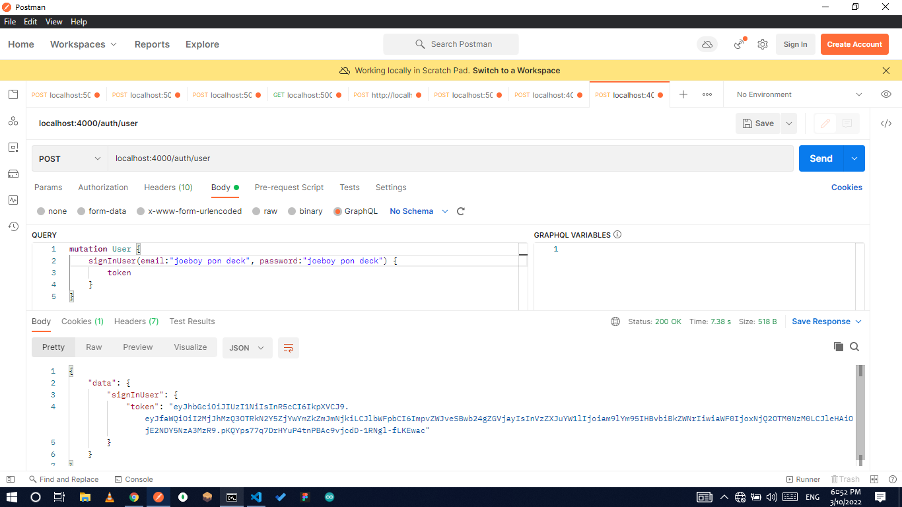
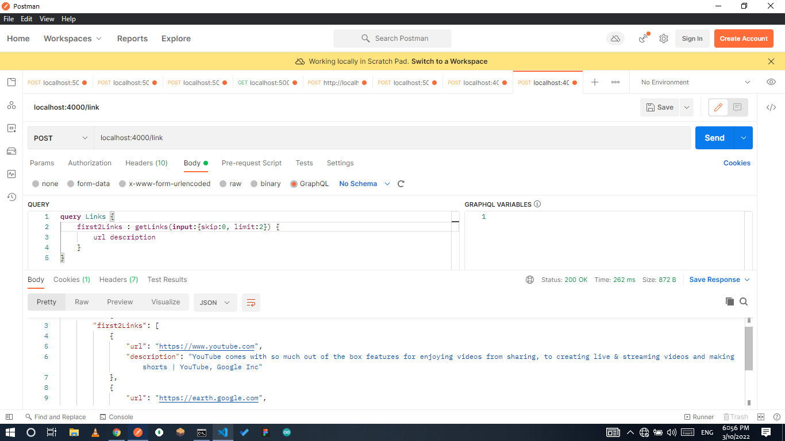

# A Simple GraphQL & Express Server

## Table of Contents

-   [Overview](#overview) -[Project's Description](#project-description) -[A peek inside my project](#screenshot)
-   [Cloning & Installation](#cloning-installation)
-   [Let's run the application](#lets-run-the-application)
-   [Author](#author)
-   [Technologies Used](#technologies-used)
    -   [Syntax & Practices](#syntax--practices)

## Overview

### Project's Description 🧐

A graphql-express application that allows user sign-up (using username, password and email), sign-in (using email, password), creating link(url, and description) and updating created Links.

P.S 🥱
No 2 users can have the same email address, as this is used in user sign-in

### A peek inside my project




## Cloning & Installation

### Cloning project

To clone this project to any directory of your choice run this code on your terminal

> git clone https://github.com/E-Zbox/simple-graphql-express-project

### Installing project on local machine

Now that project has been cloned successfully, change directory on your terminal by `cd simple-graphql-express-project`.
Run the following command to install neccessary dependencies

> npm install

## Let's run the application

To run this application on development mode (reload on file change), type

> npm run dev
> on your terminal. Navigate to `localhost:4000/auth/user` on Postman and set request method to POST "this is the default method used in the project"

## Check out this lines

[UserController](./controllers/UserController.js)

```javascript
require("dotenv").config();
const { BCRYPT_SALT, JWT_SECRET } = process.env;
const { join } = require("path");
const { readFileSync } = require("fs");
const { makeExecutableSchema } = require("@graphql-tools/schema");
```

[Schema](./schema.graphql)

```graphql
input LinkInput {
    url: String!
    description: String!
}
...
type Mutation {
    signUpUser(email: String!, password: String!, username: String!): User
    signInUser(email: String!, password: String!): Login
    createLink(input: LinkInput!): Link
    updateLink(input: IDInput!): Link
}
```

## Author

Follow me on social media [twitter](https://twitter.com/ceocodes)

## Technologies Used

-   [Node](https://nodejs.dev)
-   [Express JS](https://expressjs.com)
-   [GraphQL](https://graphql.org)

### Database

-   [Mongoose](https://mongoosejs.com/)

### Syntax & Practices

-   COMMON JS - module import and export
-   Routing & Middlewares
-   Easy to understand graphs and resolvers
